# Code Jam Lösungsvorschlag
- [Code Jam Lösungsvorschlag](#code-jam-lösungsvorschlag)
- [To Do](#to-do)
- [Voraussetzungen](#voraussetzungen)
- [SAP Cloud Integration](#sap-cloud-integration)
  - [Hauptprozess](#hauptprozess)
  - [Error Handling](#error-handling)
  - [Datentransformation](#datentransformation)
- [RAP/ABAP](#rapabap)
  - [Database Tables](#database-tables)
  - [Data Definitions](#data-definitions)
  - [Behavior Definitions](#behavior-definitions)
  - [Service Definition](#service-definition)
  - [Service Binding](#service-binding)
- [Kommunikation CPI - Backend](#kommunikation-cpi---backend)
    - [Create communication user](#create-communication-user)
    - [Create communication system](#create-communication-system)
    - [Create communication arrangement](#create-communication-arrangement)
  - [Testen des Prozesses](#testen-des-prozesses)


# To Do

<mark> 
- value id in iFlow setzen<br>
- löschen value table<br>
- anpassen profile id vs uuid 
</mark>


## Einleitung & Zielsetzung

Im Rahmen dieser Aufgabe wurde eine End-to-End-Integrationslösung entwickelt, um Energieprofile aus externen Systemen (z. B. Energiemonitoring) per HTTP in ein SAP S/4HANA Cloud System zu laden, zu validieren und dort strukturiert abzulegen. Die Lösung nutzt SAP Cloud Integration (CPI) als Middleware und das ABAP RESTful Application Programming Model (RAP) für das Backend.

---

## Architekturübersicht

Die Lösung besteht aus folgenden Komponenten:

- **SAP Cloud Integration (CPI):** Orchestriert die Integration, übernimmt Validierung, Fehlerbehandlung und Transformation.
- **ABAP Environment (RAP):** Stellt persistente Datenhaltung, Geschäftslogik und OData-Services bereit.
- **SAP Build Process Automation:** Wird für den Genehmigungsprozess verwendet.
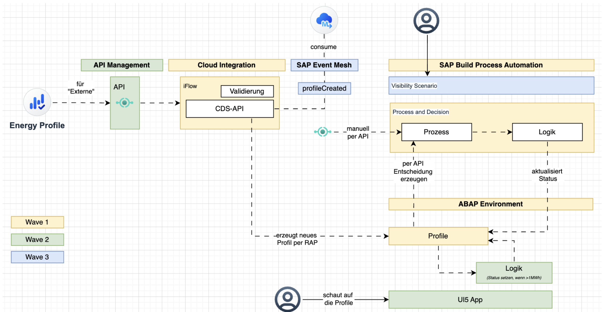


# SAP Cloud Integration
Der iFlow besteht aus drei Teilen:

## Hauptprozess
Daten werden über einen http-Request in den iFLow geschickt und im ersten Schritt (Get Body) wird einmal die Eingangsnachricht als Property gespeichert. 
Im Content Validation step wird die Eingangsnachricht validiert. In diesem Beispiel wird auf das Vorhandensein der ProfileID und des ProfileName geprüft. Außerdem findet ein Abgleich der Zeiträume statt. Validierungslogik kann hier beliebig erweitert werden.
Das Groovy-Skript gibt ein Array aus, welches die aufgetretenen Fehler enthält. Anhand dieser kann im Error-Handling der jeweilige Pfad passend zum Fehler durchlaufen werden. 

<p align="center">
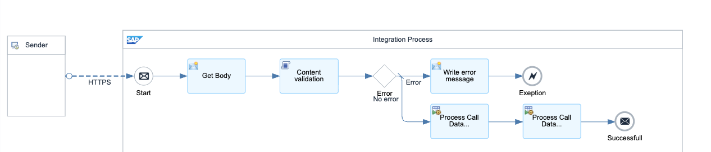
</p>

<details open>
<summary>Validierungsskript</summary>

```Groovy
import com.sap.gateway.ip.core.customdev.util.Message; 
import groovy.json.JsonSlurper
import java.time.*
import java.time.temporal.*
import java.time.format.DateTimeFormatter


def Message processData(Message message) {
    def body = new JsonSlurper().parse(message.getBody(java.io.Reader))
    def errors = [] // Initialize the errors array
    def String test = "Errors occurred: non-empty error array";
    try {
        // Get the message body as a string
        def profileId = body.profileHeader.profileId ?:
        message.setProperty("profileId", profileId)
    } catch (Exception e) {
        errors.add("profileId")
    }
    try {
        // Get the message body as a string
        def profileId = body.profileHeader.profileName ?: // Set the validated profileId as a property
        message.setProperty("profileName", profileName)
    } catch (Exception e) {
        errors.add("profileName")
    }
    // Compare two fields
    def field1 = body.profileHeader.totalPeriod.start
    def field2 = body.profileHeader.totalPeriod.end
    def field3 = body.profileValues[0].start
    def field4 = body.profileValues[-1].end
    // Define the formatter according to your date format
    def formatter = DateTimeFormatter.ofPattern("yyyy-MM-dd") // Change pattern if needed
    // Parse the dates
    def start = LocalDate.parse(field1, formatter)
    def end = LocalDate.parse(field2, formatter)
    def start2 = LocalDate.parse(field3, formatter)
    def end2 = LocalDate.parse(field4, formatter)
    def time = ChronoUnit.WEEKS.between(start, end)
    def period = ChronoUnit.WEEKS.between(start2, end2)
    // Store results in message properties
    message.setProperty("weeksBetweenTotalPeriod", time)
    message.setProperty("weeksBetweenProfileValues", period)
    if (period != time) {
        errors.add("dates")
    }
    if (errors != null && !errors.isEmpty()) {
        message.setProperty("validation_error", errors.join(", "))
        //throw new Exception(test + " " + errors)
    }
    return message;
}

```

</details>


## Error Handling 
Für das Error handling sind im Subprozess bereits verschiedene Abläufe vorbereitet, je nachdem welcher Fehler im Validierungsprozess auftritt. Hier kann ebenfalls der Prozess beliebig angepasst werden. Aktuell wird in der Response ein Fehlertext ausgegeben.

<p align="center">
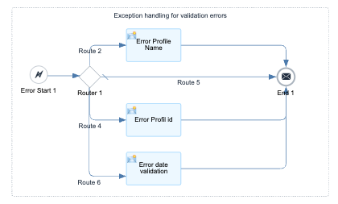
</p>


## Datentransformation

Die Transformation der Daten ist notwendig, damit das schicken der Nachricht über den ODATA-Ausgangskanal erfolgen kann. Hierbei wird in unserem Beispiel eine Umwandlung von JSON in XML Format durchgeführt, um anschließend das Message Mapping nutzen zu können, welches die eingehende Nachricht so transformiert, dass sie zu dem passt, was das Folgesystem erwartet.


<p align="center">
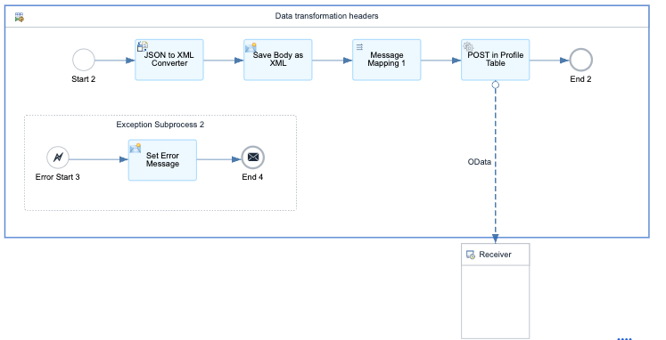
</p>

<p align="center">
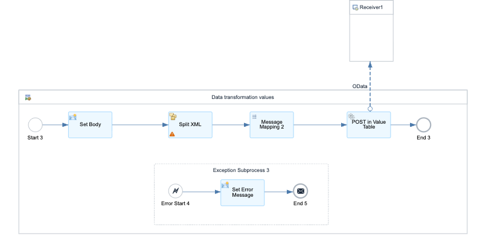
</p>


# RAP/ABAP 

Unter folgendem Link ist die Anleitung zu finden, wie die einzelnen Elemente in Eclipse angelegt werden:
[Create Database Table and Generate UI Service](https://developers.sap.com/tutorials/abap-environment-rap100-generate-ui-service.html)

<p align="center">

</p>


## Database Tables

Als erstes werden zwei Tabellen benötigt, um die Daten zu speichern.
<details open>
  <summary>Energy Profile Tabelle</summary>

```ABAP
@EndUserText.label : 'Energy Profile'
@AbapCatalog.enhancement.category : #NOT_EXTENSIBLE
@AbapCatalog.tableCategory : #TRANSPARENT
@AbapCatalog.deliveryClass : #A
@AbapCatalog.dataMaintenance : #RESTRICTED
define table zprofile {

  key client          : abap.clnt not null;
  key id              : sysuuid_x16 not null;
  key profile_id      : abap.char(20) not null;
  profile_name        : abap.char(80);
  profile_type        : abap.char(40);
  description         : abap.char(120);
  customer_type       : abap.char(20);
  unit                : abap.char(10);
  region              : abap.char(40);
  data_source         : abap.char(40);
  profile_version     : abap.char(10);
  period_start        : abap.dats;
  period_end          : abap.dats;
  total_energy_amount : abap.dec(15,2);
  created_by          : abp_creation_user;
  created_at          : tzntstmpl;
  lastchangedby       : abp_lastchange_user;
  lastchangedat       : abp_lastchange_tstmpl;
  locallastchanged    : abp_locinst_lastchange_tstmpl;

}
```

</details>

<details open>
<summary>Profile Values Tabelle</summary>

```ABAP
@EndUserText.label : 'Energy Profile Value'
@AbapCatalog.enhancement.category : #NOT_EXTENSIBLE
@AbapCatalog.tableCategory : #TRANSPARENT
@AbapCatalog.deliveryClass : #A
@AbapCatalog.dataMaintenance : #ALLOWED
define table zprofile_value {

  key profile_id : abap.char(20) not null;
  value_id       : abap.numc(4);
  period_start   : abap.dats;
  period_end     : abap.dats;
  energy_amount  : abap.dec(15,2);

}
```

</details>

## Data Definitions
Data Definitions (kurz: CDS Data Definitions) sind spezielle Objekte in ABAP, mit denen du Datenmodelle in der ABAP-Plattform deklarativ beschreiben kannst.
Sie werden mit der Sprache Core Data Services (CDS) geschrieben und sind die Grundlage für moderne Datenzugriffe (z. B. für RAP, OData, Fiori).

Data Definition = eine CDS-View, die beschreibt, welche Felder und Beziehungen (z. B. Joins, Assoziationen) aus einer oder mehreren Tabellen für Anwendungen bereitgestellt werden.
Sie geben vor, wie Daten aus Datenbanktabellen gelesen und zusammengeführt werden.
Sie sind das zentrale Modellierungswerkzeug für das neue ABAP-Datenmodell.

<details open>
<summary>Profile Data Definition</summary>

```ABAP
@EndUserText.label: 'Profile Entity'
@AccessControl.authorizationCheck: #NOT_REQUIRED

define root view entity Z_I_PROFILE
as select from zprofile
  {
     key profile_id,
      profile_name,
      profile_type,
      description,
      customer_type,
      unit,
      period_start,
      period_end,
      total_energy_amount,
      created_by,
      created_at 
     
}
```

</details>


<details open>
<summary>Profile Values Data Definition</summary>

```ABAP

@AccessControl.authorizationCheck: #NOT_REQUIRED
@EndUserText.label: 'Profile Value'
define root view entity  Z_I_PROFILEVAL as select from zprofile_value
{
    key profile_id,   // Foreign key to header
        key value_id,     
        period_start,
        period_end,
        energy_amount
}

```
</details>

Während die beiden vorherigen Data Definitions je eine Entität enthalten, werden in der folgenden beide Entitäten zusammen gebracht und über die ProfileId miteinander verknüpft. Diese wird ebenfalls in der Service Definition exposed und kann so über das UI aufgerufen werden.

<details open>
<summary>Profile Values Tabelle</summary>

```ABAP
@EndUserText.label: 'Energy Profile with Values'
define view entity ZProfile_Export
  as select from zprofile
    association to zprofile_value as _Values
      on $projection.profile_id = _Values.profile_id
{
     key profile_id,
      profile_name,
      profile_type,
      description,
      unit,
      period_start,
      period_end,
      total_energy_amount,
      _Values.profile_id as ProfileId,
      _Values.value_id as ValueId,
      _Values.period_start as PeriodStart,
      _Values.period_end as PeriodEnd,
      _Values.energy_amount as EnergyAmount
}


```
</details>

## Behavior Definitions
Behavior Definitions sind ein zentrales Konzept im ABAP RESTful Application Programming Model (RAP).

Mit Behavior Definitions legst du fest, welche Aktionen auf deinen Daten (z. B. CDS-Views) möglich sind.
Sie definieren, wie sich die Daten verhalten – z. B. ob Datensätze erstellt, geändert, gelöscht werden dürfen, ob sie gesperrt werden können, oder welche eigenen Aktionen (z. B. „Freigeben“) es gibt.
Sie sind quasi die Geschäftslogik-Schicht zwischen Datenmodell und Benutzeroberfläche/API.

```ABAP
managed implementation in class zbp_i_profile unique;


define behavior for Z_I_PROFILE
  persistent table zprofile

  lock master
{
  create;
  update;
  delete;

}
```
```ABAP
managed implementation in class zbp_i_profileval unique;


define behavior for Z_I_PROFILEVAL //alias <alias_name>
persistent table zprofile_value
lock master

{
  create;
  update;
  delete;

}
```
## Service Definition
    
```ABAP
@EndUserText.label: 'Z_PROFILE_SRV'
define service Z_PROFILE_SRV {
  expose Z_I_PROFILE;
  expose Z_I_PROFILEVAL;
  expose ZProfile_Export;
}
```
## Service Binding
<p align="center">
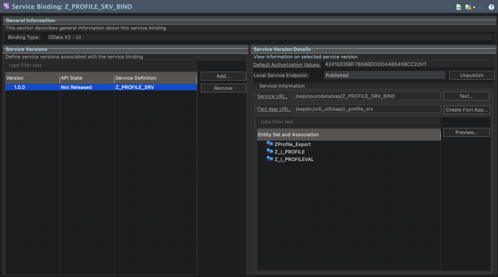
</p>


# Kommunikation CPI - Backend 

<p align="center">
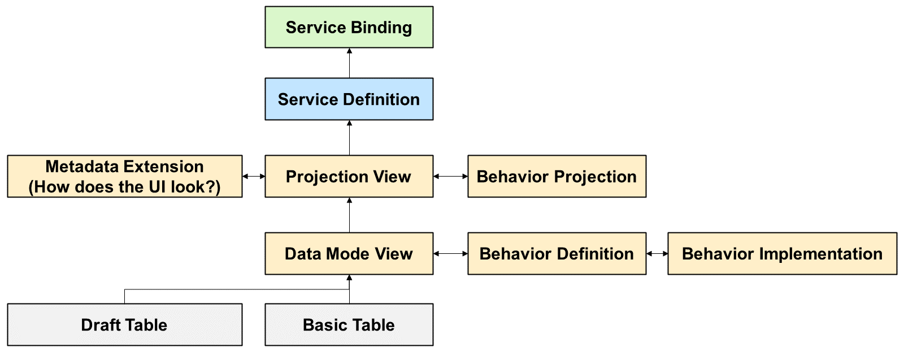
</p>

Um eine Kommunikation zwischen der CPI und dem Backend zu ermöglichen, wird ein "Communication Arrangement for Inbound Communication" benötigt. Hierfür muss zuerst ein Communication Scenario erstellt werden (siehe Create a communication scenario
https://developers.sap.com/tutorials/abap-environment-business-service-provisioning.html step 9).

<p align="center">
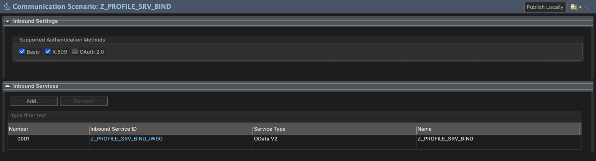
</p>
<p align="center">
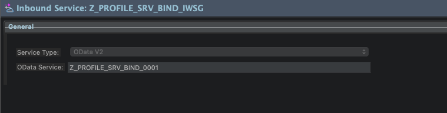
</p>

Anschließend werden alle benötigten Elemente mit Hilfe des Tutorials angelegt.
https://developers.sap.com/tutorials/abap-environment-communication-arrangement.html

<p align="center">

</p>

### Create communication user
<p align="center">
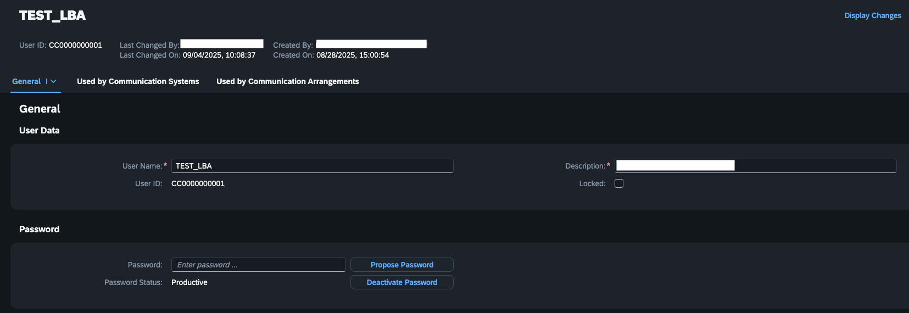
</p>

### Create communication system
<p align="center">
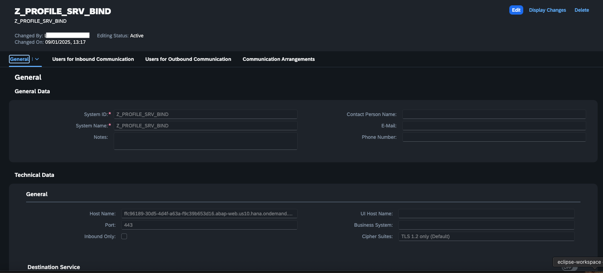
</p>
<p align="center">
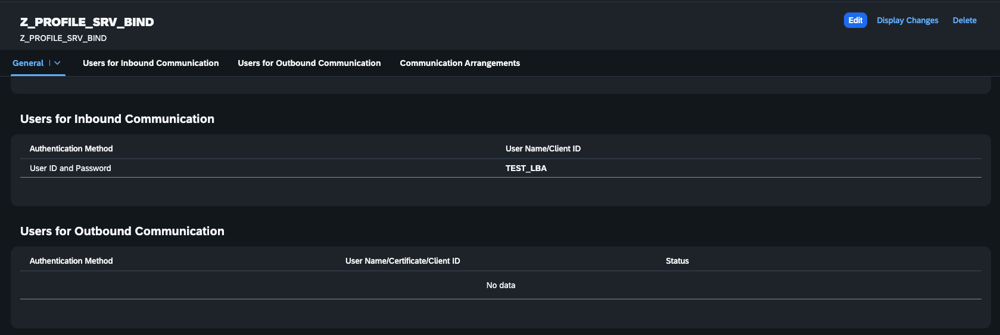
</p>


### Create communication arrangement

<p align="center">
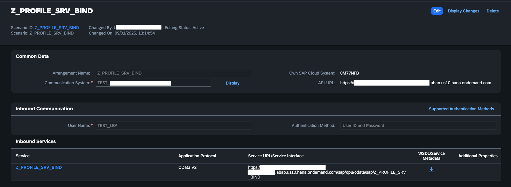
</p>


## Testen des Prozesses

Um den Prozess zu teste, wird der iFlow über Bruno/Postman aufgerufen. Der Body beinhaltet hierbei die JSON mit der Beispielstruktur:

```JSON
{
  "profileHeader": {
    "profileId": "EP-2022-2024-001",
    "profileName": "Household Electricity Consumption 2022-2024",
    "profileType": "AnnualEnergyProfile",
    "description": "Aggregated energy profile for a household customer from 2022 to 2024.",
    "unit": "kW",
    "totalPeriod": {
      "start": "2022-01-01",
      "end": "2024-12-31"
    },
    "totalEnergyAmount": 9000.4,
    "createdAt": "2024-05-16",
    "createdBy": "EnergyMonitoringSystem",
    "additionalInformation": {
      "customerType": "Household",
      "region": "SampleCity",
      "dataSource": "SmartMeter",
      "profileVersion": "1.0"
    }
  },
  "profileValues": [
    {  
      "start": "2022-01-01",
      "end": "2022-12-31",
      "energyAmount": 3200.5
    },
    {
      "start": "2023-01-01",
      "end": "2023-12-31",
      "energyAmount": 2950.2
    },
    {
      "start": "2024-01-01",
      "end": "2024-12-31",
      "energyAmount": 2849.7
    }
  ]
}
```

Eine Bruno-Collection mit entsprechenden Requests ist ebenfalls in Github zu finden.


# Business Process Automation
<mark> Umsetzung auf BPA Seite in Arbeit </mark>

Platzhalter: Hier beschreibst du den Teil des Prozesses, der in SAP Build Process Automation (BPA) umgesetzt wurde. Gehe darauf ein, welche Aufgaben automatisiert werden (z. B. Genehmigungsprozesse, Workflow-Steuerung, Monitoring oder manuelle Freigaben) und wie BPA mit den anderen Komponenten (CPI, RAP) interagiert.

Trigger durch eingehende Daten
Anstoßen eines Workflows zur Freigabe von Energieprofilen
Automatisierte Benachrichtigung an Verantwortliche
Rückmeldung des Ergebnisses an das Backend oder zur weiteren Verarbeitung in CPI
